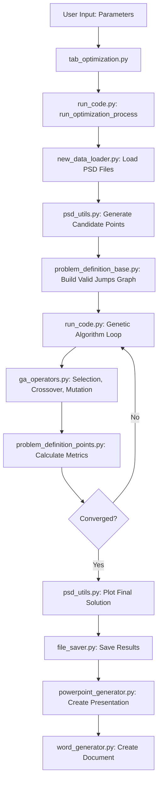
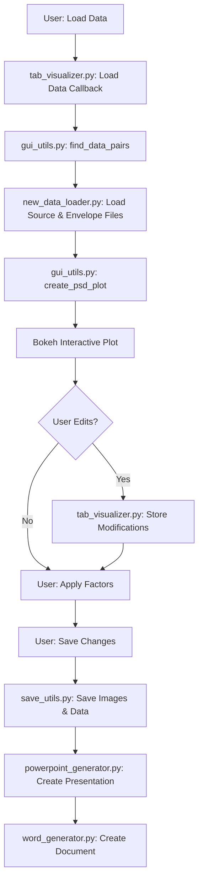

# System Architecture

## High-Level Overview

The PSD (Power Spectral Density) Analysis Tool is a Python-based application that optimizes PSD envelope curves using a genetic algorithm. The system processes PSD measurement data from MATLAB (.mat) and text (.txt) files, applies optimization algorithms to find optimal "knee points" that define envelope specifications, and provides a web-based GUI for visualization and manual editing.

The system serves engineers and analysts who need to:
- Optimize PSD envelope curves to meet specific point count and area ratio targets
- Visualize and compare original PSD data with optimized envelopes
- Manually edit envelope points through an interactive interface
- Generate reports (PowerPoint presentations and Word documents) from results

## Main Components

### 1. GUI Layer (`app/`)
The user interface layer built on Bokeh, providing a web-based interactive interface.

**Components:**
- **`gui.py`**: Entry point for the Bokeh server, creates and combines tab panels
- **`tab_optimization.py`**: Optimization tab UI - controls for running genetic algorithm optimization
- **`tab_visualizer.py`**: Visualizer tab UI - interactive PSD/envelope comparison and editing
- **`gui_utils.py`**: GUI utility functions (RMS calculation, Bokeh plot creation)
- **`save_utils.py`**: File saving utilities (images, data files)
- **`powerpoint_generator.py`**: PowerPoint presentation generation from images
- **`word_generator.py`**: Word document generation from images

### 2. Optimizer Core (`optimizer_core/`)
The genetic algorithm engine and problem definition layer.

**Components:**
- **`config.py`**: Centralized configuration parameters for the genetic algorithm
- **`problem_definition_points.py`**: Problem-specific fitness function and cost calculation
- **`problem_definition_base.py`**: Base graph building, validation, and solution generation
- **`ga_operators.py`**: Genetic operators (selection, crossover, mutation)
- **`new_data_loader.py`**: Data loading from .mat and .txt files
- **`psd_utils.py`**: PSD processing utilities (candidate point generation, plotting)
- **`file_saver.py`**: Result file saving utilities

### 3. Main Execution Script (`run_code.py`)
Orchestrates the optimization process, handles multiprocessing, and coordinates all components.

### 4. Utilities (`utils/`)
Supporting utilities used across the system.

**Components:**
- **`logger.py`**: Centralized logging system with color-coded console output

## Data Flow

### Optimization Workflow

### Visualization Workflow

## Component Dependencies

### GUI Layer Dependencies
- `app/gui.py` → `app/tab_optimization.py`, `app/tab_visualizer.py`
- `app/tab_optimization.py` → `run_code.py`
- `app/tab_visualizer.py` → `app/gui_utils.py`, `app/save_utils.py`, `app/powerpoint_generator.py`
- `app/gui_utils.py` → `optimizer_core/new_data_loader.py`
- `app/save_utils.py` → `optimizer_core/file_saver.py`, `app/word_generator.py`

### Optimizer Core Dependencies
- `run_code.py` → All `optimizer_core/` modules, `app/powerpoint_generator.py`, `app/save_utils.py`
- `optimizer_core/problem_definition_points.py` → `optimizer_core/problem_definition_base.py`, `optimizer_core/config.py`
- `optimizer_core/ga_operators.py` → `optimizer_core/config.py`
- `optimizer_core/psd_utils.py` → `optimizer_core/config.py`, `optimizer_core/file_saver.py`
- `optimizer_core/new_data_loader.py` → `optimizer_core/config.py`, `optimizer_core/file_saver.py`

### Cross-Cutting Dependencies
- All modules → `utils/logger.py` (for logging)

## Design Decisions & Rationale

### 1. Genetic Algorithm Approach
**Why**: PSD envelope optimization is a complex multi-objective problem (minimize points while maintaining area ratio). Genetic algorithms excel at exploring large solution spaces and finding near-optimal solutions.

**Trade-offs**: GA requires more computation time than greedy algorithms but provides better solutions. The system uses multiprocessing to mitigate this.

### 2. Graph-Based Solution Representation
**Why**: Solutions are represented as paths through a pre-computed graph of valid "jumps" between candidate points. This ensures all solutions are valid (envelope always above PSD) without expensive runtime validation.

**Trade-offs**: Graph building is computationally expensive but only done once per optimization run. The graph is pruned to remove dead-end paths, improving efficiency.

### 3. Bokeh for GUI
**Why**: Bokeh provides interactive web-based plots with built-in editing tools (drag, add, delete points), eliminating the need for custom event handling.

**Trade-offs**: Bokeh requires a server process, but this enables remote access and better scalability than desktop GUI frameworks.

### 4. Multiprocessing for Parallelization
**Why**: Each PSD measurement is optimized independently, making parallelization straightforward. Multiprocessing allows multiple optimizations to run simultaneously.

**Trade-offs**: Multiprocessing requires careful state management (config dictionary passing) but significantly reduces total processing time for batch operations.

### 5. Unified Data Loading System
**Why**: Different file formats (.mat with various structures, .txt) require different extraction logic. A unified loading system (`new_data_loader.py`) provides a consistent interface while handling format variations internally.

**Trade-offs**: More complex than format-specific loaders, but eliminates code duplication and ensures consistent behavior.

## Extensibility Notes

### Safe Extension Points

1. **New File Formats**: Add extraction functions to `optimizer_core/new_data_loader.py` following the existing pattern. The `load_data_from_file()` function will automatically attempt new extraction methods.

2. **New Mutation Operators**: Add functions to `optimizer_core/ga_operators.py` and integrate them into `apply_mutations()`. The mutation system is designed to be extensible.

3. **New Fitness Metrics**: Modify `optimizer_core/problem_definition_points.py::calculate_metrics()` to add new cost components. The function already supports multiple objectives.

4. **New GUI Tabs**: Create new tab files in `app/` following the pattern of `tab_optimization.py` and `tab_visualizer.py`, then import and add to `app/gui.py`.

5. **New Report Formats**: Add generators in `app/` following the pattern of `powerpoint_generator.py` and `word_generator.py`.

### Modules Intended for Extension

- **`optimizer_core/config.py`**: Add new configuration parameters as needed
- **`optimizer_core/problem_definition_points.py`**: Modify fitness function for different optimization goals
- **`optimizer_core/ga_operators.py`**: Add new genetic operators

### Abstraction Layers

- **Data Loading**: `new_data_loader.py` provides a unified interface hiding file format details
- **Problem Definition**: `problem_definition_base.py` provides graph building and validation that can be reused for different problem types
- **Logging**: `utils/logger.py` provides consistent logging across all modules

## Known Limitations

1. **Graph Building Performance**: For very large candidate point sets (>10,000 points), graph building can take significant time. The `BREAK_THRESHOLD` optimization helps but may miss some valid paths.

2. **Multiprocessing Config Passing**: Configuration values must be explicitly passed in `config_dict` to worker processes. Adding new config parameters requires updating multiple locations.

3. **Bokeh Server Dependency**: The GUI requires a running Bokeh server process. If the server crashes, the GUI becomes unavailable.

4. **Memory Usage**: Large batch operations (many files) can consume significant memory, especially when creating PowerPoint/Word documents with many images.

